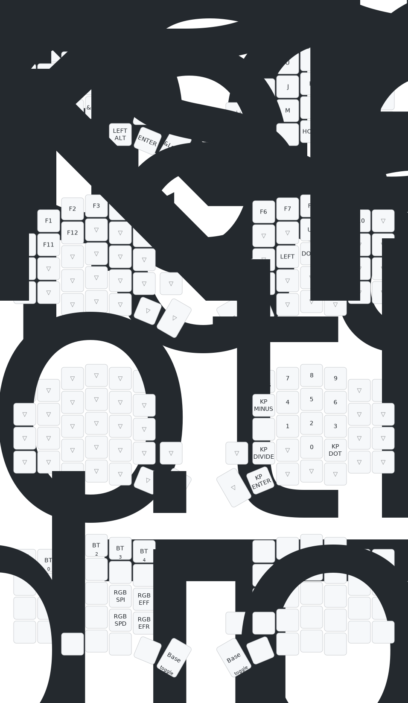

# Sofle RGB Wireless ZMK Configuration

Firmware configuration for the **Sofle RGB Wireless** split keyboard using ZMK firmware.

## Default Layout

The keyboard layout is automatically generated using `keymap-drawer` upon keymap changes:

## Changelog & Branch Features

This repository contains 4 branches tailored for different hardware setups and power preferences.

### Branch Matrix

| Feature / Branch | `led-with-animation` | `led-none-animation` | `none-led-with-animation` | `none-led-none-animation` |
| :--- | :---: | :---: | :---: | :---: |
| **RGB Underglow** | ✅ Enabled | ✅ Enabled | ❌ Disabled | ❌ Disabled |
| **Right OLED Animation** | ✅ Pokemon | ❌ Disabled | ✅ Pokemon | ❌ Disabled |
| **OLED Status Screen** | Custom (Lizard) | Custom (Lizard) | Custom (Lizard) | Custom (Lizard) |
| **WiFi Status Icons** | ✅ Custom | ✅ Custom | ✅ Custom | ✅ Custom |

### Branch Descriptions & Recent Changes

*   **`led-with-animation`**
    *   Full RGB underglow support (`CONFIG_ZMK_RGB_UNDERGLOW=y`) with RGB key bindings on the Adjust layer.
    *   Right OLED displays Pokemon peripheral animation.
    *   Left OLED displays custom Lizard status screen, numeric WPM, and battery percentage.
    *   Custom WiFi-style status icons showing full signal bars (connected) or a signal with an 'x' (disconnected).
*   **`led-none-animation`**
    *   Full RGB underglow support enabled.
    *   Animations disabled on the right OLED to optimize battery life and performance.
    *   Left OLED displays custom Lizard status screen with custom WiFi status icons.
*   **`none-led-with-animation`** (Default)
    *   RGB underglow disabled (`CONFIG_ZMK_RGB_UNDERGLOW=n`) to conserve battery.
    *   RGB key bindings and behaviors completely removed from `sofle.keymap` (replaced with `&none` and standard media keys).
    *   Right OLED displays Pokemon peripheral animation.
    *   Left OLED displays custom Lizard status screen with custom WiFi status icons.
*   **`none-led-none-animation`**
    *   RGB underglow completely disabled and key bindings removed from the keymap.
    *   Animations disabled to maximize battery life.
    *   Left OLED displays custom Lizard status screen with custom WiFi status icons.

### Key Shared Enhancements (All Branches)
*   **WiFi Connection Indicator:** Replaced default Bluetooth icon with sleek WiFi signal icons (connected = full bars, disconnected/unbonded = signal bars with an 'x').
*   **Lizard Logo Widget:** Configured the left status screen to render a custom 32x19 pixel Lizard logo instead of default widgets.
*   **Power Optimization:** Integrated aggressive sleep timers (5-minute idle, 15-minute deep sleep).
*   **Stability Tweaks:** Increased Bluetooth transmit power (`CONFIG_BT_CTLR_TX_PWR_PLUS_8=y`) and enabled experimental BLE features for better connectivity.
